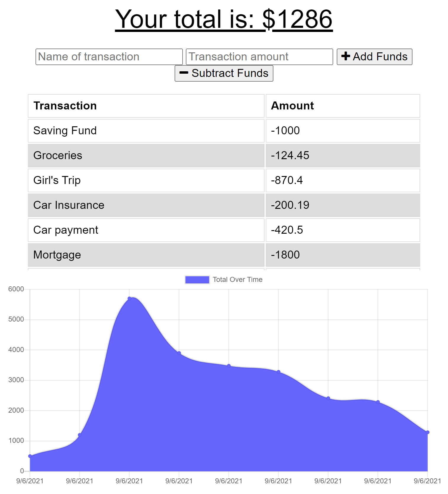

<div align="center">

# My Finances App


Built with: Service Workers, Manifest, IndexedDB

URL of the Heroku deployed application: https://hidden-savannah-95570.herokuapp.com/

URL of the GitHub repository: https://github.com/rubiocode/MyFinancesApp

</div>

## Table of Contents 

* [Description](#description)
    * [User Story](#user-story)
* [View](#view)
* [Installation](#installation)
* [Usage](#usage)
* [Built With](#built-with)
* [Credits](#credits)
* [License](#license)

## Description

_My Finances App_ is a progressive web application that uses service workers, manifest and IndexedDB to create an application able to be used online and offline. This simple and easy application allows the user to track their finances while allowing them to access full functionality of the application anytime whether the user is online or offline. 

### User Story

```md
AS AN avid traveller
I WANT to be able to track my withdrawals and deposits with or without a data/internet connection
SO THAT my account balance is accurate when I am traveling
```

## View

To view the Heroku deployed webpage click [here](https://hidden-savannah-95570.herokuapp.com/).

This is what the application looks like:

Landing Page: 




## Installation 

To start using this _My Finances App_ you must follow these instructions:

* Fork and clone this repository and save it to your computer. For help how to fork and clone click [here](https://guides.github.com/activities/forking/) 

* Open your terminal and make sure node.js is installed. To download node.js click [here](https://nodejs.org/en/download/)

* Run command _npm i_ to install all the dependencies in this repository. 

## Usage

_My Finances App_ The user is able to add or subtract their finances accordingly.  

If you are cloning this repository, run the following commands at the root of your project:

`npm start` or `nodemon server.js` to start your server


## Built With

* [Express](https://expressjs.com/) - A Node.js web application server framework used to build web applications.

* [JavaScript ES6](https://www.w3schools.com/Js/js_es6.asp) - Programming language that creates dynamic website content. ES6 or ECMAScript 6 was the second major revision to JavaScript.

* [Node.js](https://nodejs.dev/learn/) - Node.js is an open-source, low-level, back-end JavaScript runtime platform that uses asynchronous programming and is a popular tool for almost any kind of project!.

* [dotenv package](https://nodejs.dev/learn/) - A package to store enviromental variables.

* [mongoose package](https://www.npmjs.com/package/mongoose) - Mongoose is a MongoDB object modeling tool designed to work in asynchronous enviroment. 

* [morgan package = dev](https://www.npmjs.com/package/morgan) - 'Dev' specific adds color to the terminal request routes. Helps makes it easier to spot broken routes in the terminal. 

* [Compression package](https://www.npmjs.com/package/compression) - Compression middleware to minified JavaScript and files. 


## Credits

Frontend starting files provided © 2021 Trilogy Education Services, LLC, a 2U, Inc. brand. Confidential and Proprietary. All Rights Reserved.


## License


Copyright 2021 Rubidia Rubio. Licensed under the [MIT License](https://opensource.org/licenses/MIT)

All Rights Reserved. Permission is hereby granted, free of charge, to any person obtaining a copy of this software and associated documentation files (the "Software"), to deal in the Software without restriction, including without limitation the rights to use, copy, modify, merge, publish, distribute, sublicense, and/or sell copies of the Software, and to permit persons to whom the Software is furnished to do so, subject to the following conditions:

The above copyright notice and this permission notice shall be included in all copies or substantial portions of the
Software.

THE SOFTWARE IS PROVIDED "AS IS", WITHOUT WARRANTY OF ANY KIND, EXPRESS OR IMPLIED, INCLUDING BUT NOT LIMITED TO THE
WARRANTIES OF MERCHANTABILITY, FITNESS FOR A PARTICULAR PURPOSE AND NONINFRINGEMENT. IN NO EVENT SHALL THE AUTHORS OR
COPYRIGHT HOLDERS BE LIABLE FOR ANY CLAIM, DAMAGES OR OTHER LIABILITY, WHETHER IN AN ACTION OF CONTRACT, TORT OR
OTHERWISE, ARISING FROM, OUT OF OR IN CONNECTION WITH THE SOFTWARE OR THE USE OR OTHER DEALINGS IN THE SOFTWARE.
